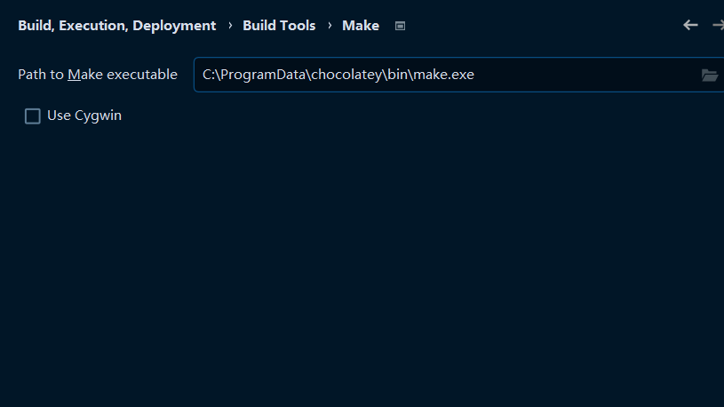
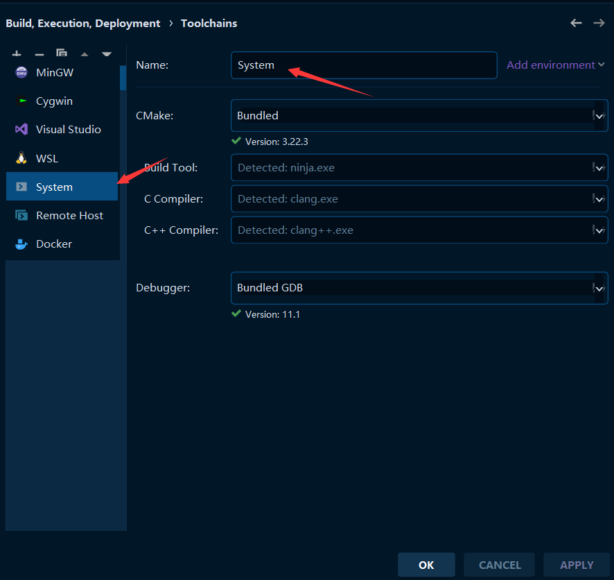
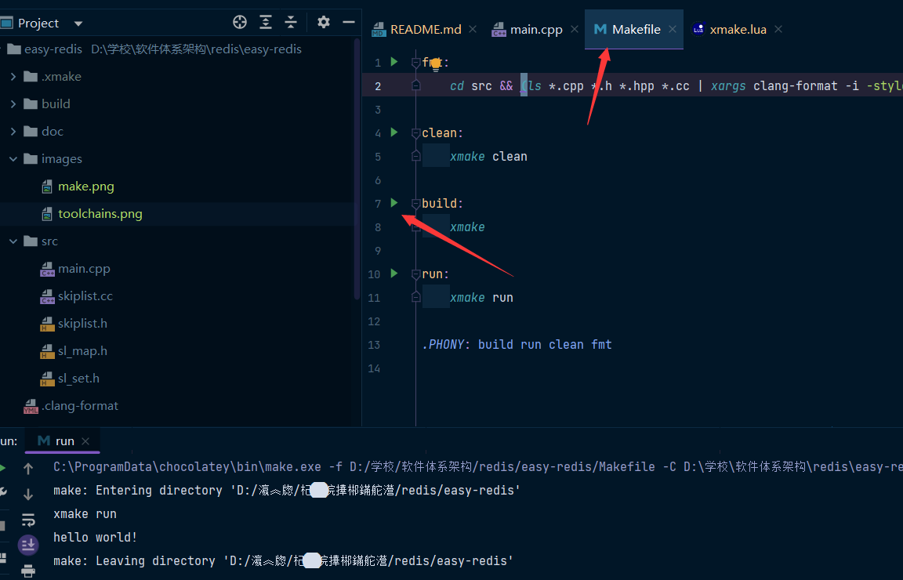

# EASY-REDIS

## 1 组件设计：

1. 词法、语法分析器（doc/lexer-parser.md）
2. 语法树生成（doc/grammer.md）
3. 语法树解析（doc/parser-node.md）
4. 数据处理系统（doc/data-manage.md）
5. 输入输出接口（doc/io-interface.md）

## 2 如何开发

### 2.1 建立环境

#### xmake

本项目使用xmake构建，首先需要安装xmake：

安装方式见：[https://xmake.io/#/zh-cn/guide/installation](https://xmake.io/#/zh-cn/guide/installation)

#### IDE 插件

##### 1. IDEA / CLion

搜索安装 xmake 插件，如下图：

##### 2. VS Code

搜索安装 xmake 插件，如下图：

#### 编码规范

本项目使用 **基于WebKit** 的编码规范，项目中含有正确配置的 `.clang-format` 文件，使用 `clang-format` 能够正确地格式化代码格式。

#### 编译器

本项目使用 clang 编译器，目前的版本为最新版本 13.0.1，请不要使用 MSVC（VS 集成环境），可能会导致编译错误。

## 在windows中部署开发环境
+ 下载 [LLVM](https://github.com/llvm/llvm-project/releases/download/llvmorg-14.0.0/LLVM-14.0.0-win64.exe) 
+ 安装LLVM的时候勾选加入环境变量（方便clion自动检测）
+ 下载安装[XMAKE](https://github.com/xmake-io/xmake/releases/download/v2.6.4/xmake-v2.6.4.win64.exe)
+ 安装[chocolatey](https://docs.chocolatey.org/en-us/choco/setup)（若有请忽略）
+ 进入powershell执行命令`choco install make`（普通命令行权限不够）
+ 在clion中修改make路径
+ 
+ 在clion中安装xmake插件（如果有，我反正没有不知道为什么）
+ 配置toolchains，在toolchain中新建system，会自动检测到clang compiler
+ 
+ 测试配置
+ 